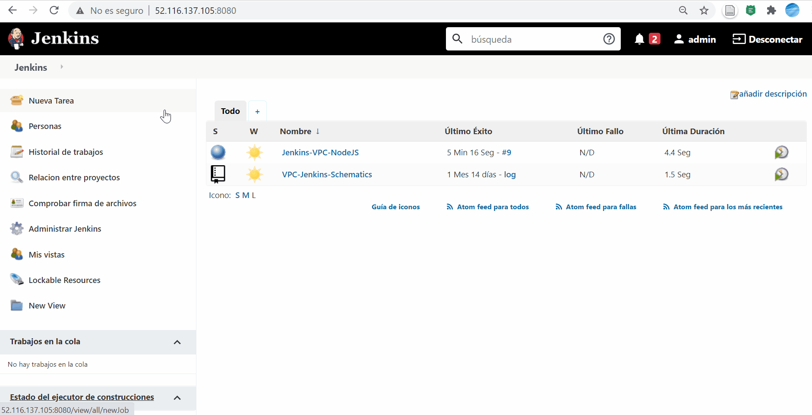
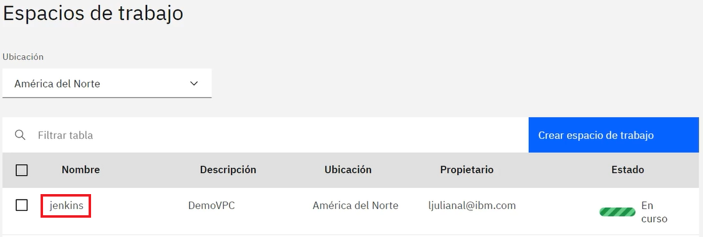
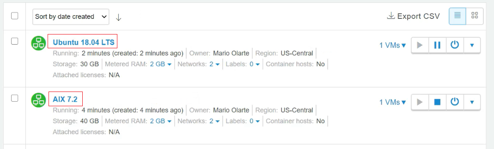

# Jenkins DevOps on IBM Cloud Schematics :cloud:

En esta guía encontrará una descripción detallada sobre la automatización del despliegue de Infraestructura con IBM Cloud Schematics usando Jenkins.

 

## Pre-requisitos

Copie el Jenkinsfile de esta guía a un repositorio personal y modifique la variable **"Token"**, este valor permite a Jenkins crear recursos mediante Schematics en su cuenta de IBM Cloud, para obtener un nuevo token ejecute el siguiente comando, si no cuenta con la CLI de IBM Cloud encuentre las [instrucciones de instalación en este link.](https://cloud.ibm.com/docs/cli?topic=cli-install-ibmcloud-cli)

```
ibmcloud iam oauth-tokens
```

## Creación del proyecto en Jenkins 📄

1. Dentro de la interfaz de Jenkins haga clic sobre la pestaña **"Nueva tarea"** .
2. Llene los parámetros solicitados, para este caso solo debe ingresar el nombre que le desea asignar.
3. Seleccione **"Crear un proyecto de estilo libre"** y a continuación haga clic en el botón **"OK"**.
4. Ahora en el apartado de **"Configurar el origen del código fuente"** seleccione la opción de **"git"**.
5. Una vez marcada la opción de **"git"** nos aparecerá un pequeño menú de configuración, proporcione el link donde se puede clonar su repositorio para que Jenkins tenga acceso al Jenkinsfile.
6. Agregue las credenciales para acceder a su cuenta de GitHub y guarde los cambios.

<p align="center">
  
</p>

Para ejecutar el Pipeline, seleccione **Build with Paramenters**, luego de ello aparecerán los parametros requeridos, debe selecciónar el sistema operativo sobre el cual la herramienta Jenkins esta instalado, como se muestra a continuación:


## 2. Jenkisfile :page_with_curl:	

La estructura de código del archivo Jenkinsfile consta de: 

```
pipeline {

    agent any
    parameters{
    ...
    }

    stages {
        stage('DevOps Schematics') {
            steps {
                ...
            }
        }
        
    }
}
```

El Jenkinsfile cuenta con un pipeline con diferentes directivas. La directiva **agent** determina el motor de ejecución. En este caso se acepta cualquiera. La directiva **stages** establece un conjunto de etapas. Y por último se tiene la directiva **steps** donde se determinan los pasos de ejecución de la tarea. Adicionalmente se establece un parámetro con el fin de que la plantilla sea funcional tanto para Jenkins que corren sobre sistemas operativos Linux como Windows.

La conexión de Jenkins con Schematics se hizo mediante la API de Schematics. Las peticiones y el código correspondiente se encuentran en el archivo **Jenkinsfile** del presente repositorio; estas peticiones responden a los pasos necesarios para aprovisonar un recurso dentro de Schematics (que se encuentran referenciados en la [Documentación](https://cloud.ibm.com/docs/schematics?topic=schematics-getting-started)) de Schematics y los cuales son:

1). Crear un workspace

2). Crear un plan

3). Aplicar un plan

La estructura general de las peticiones a la API de Schematics se encuentra a continuación:

Linux:
```
curl --request _(POST, PUT, GET)_ --url <URL> -H <Token _de_Autorización> -d <Datos_de_petición>
```
Windows:
```
Invoke-RestMethod -Uri <URL> -Method <GET-POST-PUT> -Headers <Token_de_Autorización> -Body <Datos_de_petición>
```

## 3. Resultados

Al ejecutar un nuevo Pipeline puede encontrar la descripción del proceso al ingresar a la información de los logs. También puede corroborar que el proceso fue exitoso al ingresar a la lista de workspaces, donde se creará el workspace "jenkins".



También puede ingresar a la interfaz de Skytap donde encontrará las dos máquinas aprovisionadas, con las características especificadas dentro de la [plantilla de Terraform](https://github.com/emeloibmco/Skytap-DevOps-Terraform) usada en la guía.



## Referencias
Encuentre la plantilla de Terraform utilizada en: [Plantilla Terraform](https://github.com/emeloibmco/Skytap-DevOps-Terraform)
<br>
Encuentre información sobre Jenkins en: [Jenkins documentation](https://www.jenkins.io/doc/)
<br>
Encuentre información sobre IBM Cloud Schematics API en: [IBM Cloud Schematics API](https://cloud.ibm.com/apidocs/schematics)
<br>

## Autores :black_nib:
IBM Cloud Tech Sales
