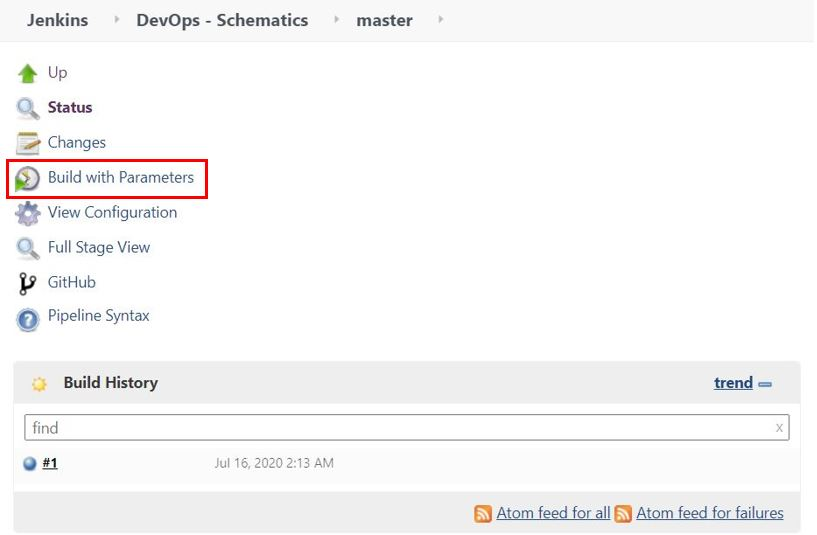

# Jenkins DevOps on IBM Cloud Schematics :cloud:

En esta guía encontrará una descripción detallada sobre DevOps con Jenkins en la herrarmienta Schematcis para automatización de Infraestructura

 


## 1.[Jenkins](https://www.jenkins.io/doc/)

Jenkins es un servidor de automatización de código abierto autónomo que se puede utilizar para automatizar todo tipo de tareas relacionadas con la creación, prueba y entrega o implementación de software. Jenkins se puede instalar a través de paquetes del sistema nativo, Docker, o incluso ejecutarse de forma independiente en cualquier máquina que tenga instalado un Java Runtime Environment (JRE). 

### Archivos :bookmark_tabs:

Para el uso de DevOps en Schematics se tiene el archivo Jenkinsfile.

- Jenkinsfile

### Archivos :bookmark_tabs:

La ejecución de la tarea DevOps, requiere de la selección del sistema operativo donde la herramienta Jenkins está configurada. El sistema operativo por defecto es Windows, sin embargo se debe especificar si se tiene el Jenkins configurado en Linux a la hora de ejecutar la tarea, como se muestra en la siguiente imagen:

 

## 2. Configuración del proyecto en Jenkins

La configuración en de la tarea en DevOps requiere de la creación de un proyecto **Multibranch Pipeline** para la configuraciónde un repositorio Github el cual contendrá el archivo Jenkinsfile para ejecutar la tarea.
Una vez creado el proyecto **Multibranch Pipeline** se procede a hacer la configuración de _Branch Sources_ como aparece en la siguiente imagen:

 

Como se puede ver se deben añadir las credenciales del usuario en GitHub y luego de ello al ingresar la dirección del repositorio en GitHub, se debe tener la confirmación de las credenciales.

Para añadir las credenciales de la cuenta de GitHub se debe rellenar la información de **Username** y **Password** como se muestra en la siguiente imagen:


Una vez creado el proyecto se puede observar un _DASHBOARD_ como aparece en la siguiente imagen:


En donde se selecciona el **commit** master que contiene el archivo Jenkinsfile para la ejecución de tareas.
Una vez alli se observa el _DASHBOARD_ del **master** como se observa a continuación:



## 3. Despliegue en Schematics :wrench: 

Se debe dirigir al simbolo de menú en donde encontrará la opción de **Schematics** una vez alli se creará un nuevo workspace donde se contará con la siguiente pestaña:

 

Para la configuración de la SSH Keys se debe abrir la terminar del PC en ingresar el comando 
```sh
ssh-keygen -m PEM -t rsa -f <NOMBRE_DE_LA_LLAVE>
```


Al ejecutar el comando se crearan dos archivos. Uno de ellos con extensión .pub cuyo contenido de texto contiene una llave SSH publica. El otro archivos no tiene extensión y contiene la llave SSH privada. Se deben copiar y pegar cada una de ellas en las variables definidas anteriormente.

Luego de tener estas llaves se agregan a las variables de entrada como se muestra a continuación:


En el espacio sobremarcado con rojo se debe pegar el link del repositorio y de ser necesario en la parte de abajo el Token para permisos de acceso. Se presiona el botón sobremarcado con amarillo para adquirir las variables a rellenar. Luego de rellenarlas se debe crear el workspace. En caso de realizar el procedimiento de forma correcta se contará con la siguiente pestaña:


Se debe generar el plan con el botón que aparece en pantalla y de generarse correctamente se podrá aplicar el plan. _Solo hasta aplicar el plan se va a generar facturación_

## Resultados  :computer: 

## Referencias  :mag: 

Encuentre información sobre terraform en IBM cloud en: [Managing IBM Cloud resources with Terraform](https://cloud.ibm.com/docs/terraform?topic=terraform-manage_resources)
<br>
Encuentre información sobre Puppet en: [Learn Puppet ](https://puppet.com/docs/puppet/latest/puppet_index.html)
<br>

## Autores :black_nib:
IBM Cloud Tech Sales
