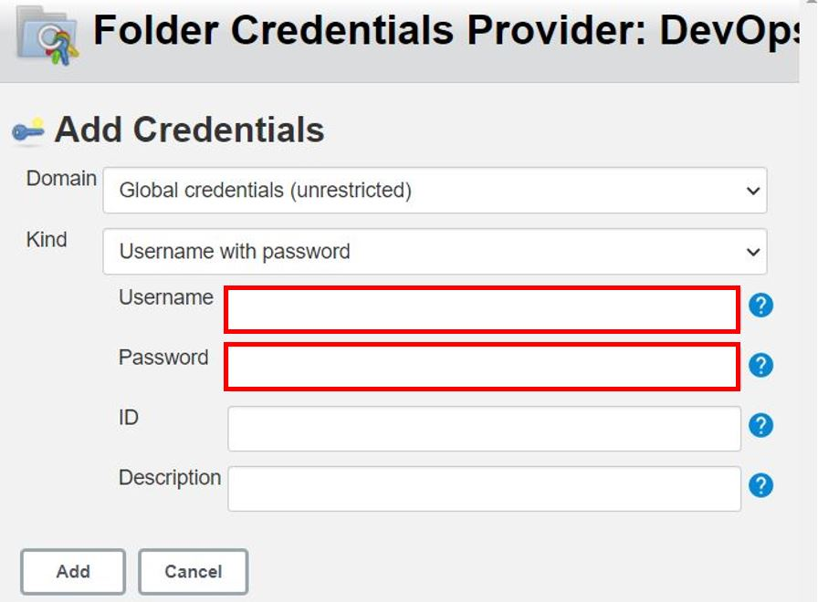
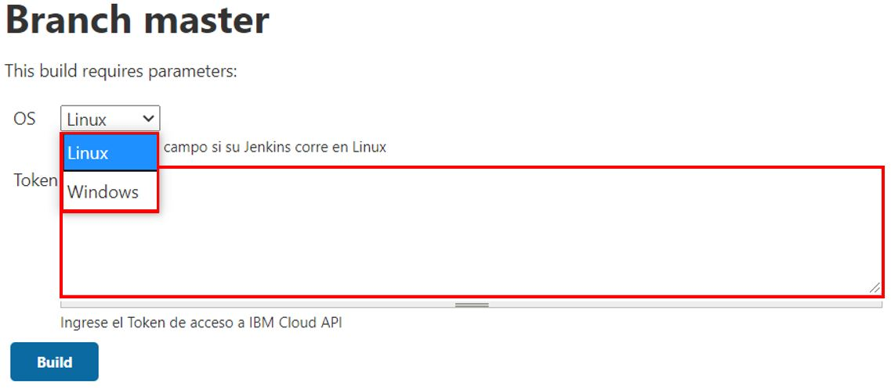

# Jenkins DevOps on IBM Cloud Schematics :cloud:

En esta guía encontrará una descripción detallada sobre DevOps con Jenkins en la herrarmienta Schematcis para automatización de Infraestructura

 

## 1. Jenkins

Jenkins es un servidor de automatización de código abierto autónomo que se puede utilizar para automatizar todo tipo de tareas relacionadas con la creación, prueba y entrega o implementación de software. Jenkins se puede instalar a través de paquetes del sistema nativo, Docker, o incluso ejecutarse de forma independiente en cualquier máquina que tenga instalado un Java Runtime Environment (JRE). 

### Archivos :bookmark_tabs:

Para el uso de DevOps en Schematics se desarrollo el archivo Jenkinsfile para ejecución de tareas desde Jenkins.

- Jenkinsfile :file_folder:

## 2. Configuración del proyecto en Jenkins :computer:

La configuración en de la tarea en DevOps requiere de la creación de un proyecto **Multibranch Pipeline** para la configuraciónde un repositorio Github el cual contendrá el archivo Jenkinsfile para ejecutar la tarea.


Una vez creado el proyecto **Multibranch Pipeline** se procede a hacer la configuración de _Branch Sources_ como aparece en la siguiente imagen:

 

Como se puede ver se deben añadir las credenciales del usuario en GitHub y luego de ello al ingresar la dirección del repositorio en GitHub, se debe tener la confirmación de las credenciales.

Para añadir las credenciales de la cuenta de GitHub se debe rellenar la información de **Username** y **Password** como se muestra en la siguiente imagen:



Una vez creado el proyecto se puede observar un _DASHBOARD_ como aparece en la siguiente imagen:


En donde se selecciona el **commit** master que contiene el archivo Jenkinsfile para la ejecución de tareas.
Una vez alli se observa el _DASHBOARD_ del **master** como se observa a continuación:


Para ejecutar el PIPELINE se selecciona **Build with Paramenters**, luego de ello aparecerán los parametros requeridos como se muestra a continuación:



Se debe selecciónar el sistema operito sobre el cual la herramienta Jenkins esta instalado. Tambien se debe ingresar el IAM Token el cual se obtiene con el siguiente comando:
```
ibmcloud iam oauth-tokens
```

## 3. Jenkisfile :page_with_curl:	

La estructura de código del archivo Jenkinsfile consta de 
```
pipeline {
    agent any

    stages {
        stage('DevOps Schematics') {
            steps {
                
            }
        }
        
    }
}
```
Donde, como se puede observar se cuenta con un pipeline con directivas. La directiva **agent** determina el motor de ejecución. En este caso se acepta cualquiera. La directiva **stages** establece un conjunto de etapas. Y por ultimo se tiene la directiva **steps** donde se determinan los pasos de ejecución de la tarea.

La conexión de Jenkins a Schematics se usó con ayuda de peticiones HTTP a la API de Schematics con los siguientes comandos dependiendo el sistema operativos

Linux:
```
curl --request _(POST, PUT, GET)_ --url _URL_ -H _Token de Autorización_ -d _Datos de petición_
```
Windows:
```
Invoke-RestMethod -Uri _URL_ -Method _(GET-POST-PUT)_ -Headers __Token de Autorización__ -Body _Datos de petición_
```

Encuentre información sobre Jenkins en: [Jenkins documentation](https://www.jenkins.io/doc/)
<br>
Encuentre información sobre IBM Cloud Schematics API en: [IBM Cloud Schematics API](https://cloud.ibm.com/apidocs/schematics)
<br>

## Autores :black_nib:
IBM Cloud Tech Sales
